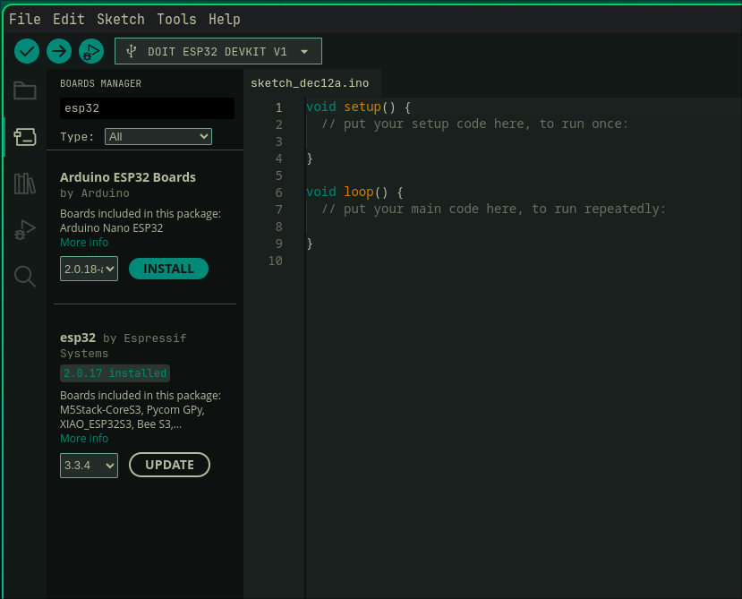
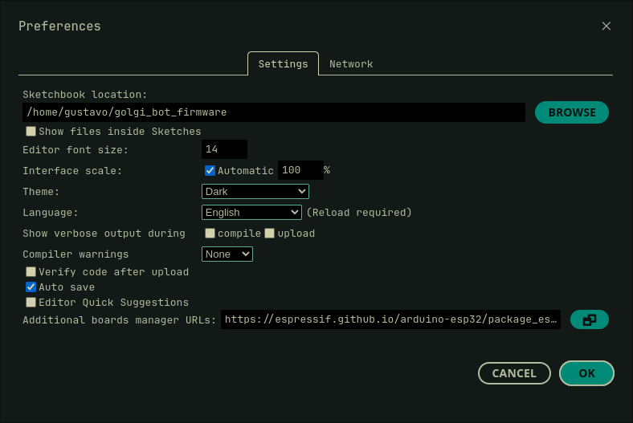

<p>
  
  
</p>

# Firmware do Golgi Bot
> Repositório para organizar o código usado no Golgi Bot, a Automação da Farmácia do Hospital Universitário.

<p>
  
  
</p>

## Como usar este repositório

Após instalar todos os requisitos listados abaixo, adicione o caminho deste repositório na Arduino IDE em:

> Arquivo → Preferências → Caminho dos Sketchbooks

Como mostrado na imagem:

<p align="center">
  
</p>

Depois disso, abra o firmware na Arduino IDE, selecione a placa correta e faça o upload para o ESP32.

---

## Selecionando a placa correta

Para compilar o firmware, selecione a placa:

> **DOIT ESP32 DEVKIT V1**

<p align="center">
  
</p>

---

## Requisitos

### Arduino IDE

Para compilar o firmware, é necessário instalar a Arduino IDE:

* Versão 2.x (moderna)
* ou Versão 1.8.19 (legacy)

Links oficiais para download (Windows, macOS e Linux):

**[https://www.arduino.cc/en/software/#ide](https://www.arduino.cc/en/software/#ide)**

No Linux, também é possível instalar:

* via o repositório da distribuição
* via Flathub (versão 2.x)

---

## Configuração da Arduino IDE

### 1. Permissões de acesso à porta serial (Linux)

Por padrão, usuários comuns não possuem permissão para acessar portas seriais (USB).
Sem essa permissão, não é possível realizar o upload para o ESP32.

---

#### Verificar seu nome de usuário

```bash
whoami
```

---

#### Distribuições baseadas em Debian (Ubuntu, Mint, etc.)

Adicione seu usuário ao grupo **dialout**:

```bash
sudo usermod -aG dialout <seu-usuario>
```

Finalize a sessão e entre novamente.
Depois confirme:

```bash
groups
```

---

#### Arch Linux e derivados

Adicione seu usuário ao grupo **uucp**:

```bash
sudo usermod -aG uucp <seu-usuario>
```

Finalize a sessão e entre novamente.
Depois confirme:

```bash
groups
```

---

### 2. Instalando o pacote do ESP32

Para adicionar suporte ao ESP32:

1. Abra **Arquivo → Preferências**
2. No campo *Additional Boards Manager URLs*, adicione a seguinte URL oficial da Espressif:

```
https://espressif.github.io/arduino-esp32/package_esp32_index.json
```

**Observação:** caso a URL deixe de funcionar, consulte a documentação oficial da Espressif para a URL mais recente:
**[https://docs.espressif.com/projects/arduino-esp32/en/latest/installing.html](https://docs.espressif.com/projects/arduino-esp32/en/latest/installing.html)**

<p align="center">
  
</p>

Em seguida:

1. Abra **Ferramentas → Board → Boards Manager**
2. Pesquise por **ESP32 by Espressif Systems**
3. Instale a versão **2.0.17**

### Observações importantes

* Não utilize versões **3.x** ou superiores, pois algumas funções usadas neste projeto foram removidas nessas versões.
* Existe uma versão publicada pela própria Arduino chamada “ESP32” — **não utilize essa**, pois ela não é compatível com o projeto.

<p align="center">
  
</p>
