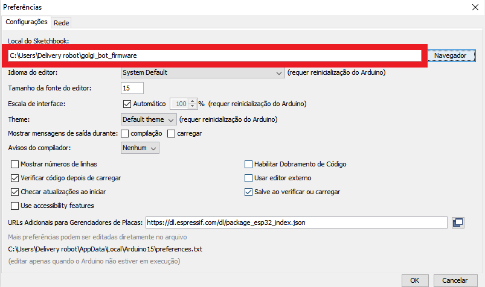

<p>
  
  
</p>

# Firmware do Golgi Bot
> Repositório para organizar o código usado no Golgi Bot, a Automação da Farmácia do Hospital Universitário.

<p>
  
  
</p>

## 💥  Como usar

- Depois de já ter instalado tudo da lista de requerimentos, adicione o o caminho desse repositório na IDE do arduino na aba de "preferências", como na imagem:



Depois disso, os arquivos do repositório podem ser executados normalmente.

## ➕ Submódulos

### Como adicionar Submódulos - template
```bash
git submodule add --name [NOME] [URL DO REPOSITÓRIO] libraries/[NOME DO REPOSITÓRIO]
```
#### Exemplo - Adicionar sensor de temperatura
```bash
git submodule add --name Temperature_sensor https://github.com/adafruit/DHT-sensor-library.git libraries/DHT-sensor-library
```
### Atualizar e Iniciar sumódulos
```bash
git submodule init

git submodule update
```

## 📦 Requeriments

### 1° Instalar o uncrustify

- Ubuntu:
```bash
sudo apt install uncrustify
```

- Windows:

```
Download zip
On Windows, download the latest version of Uncrustify here: https://sourceforge.net/projects/uncrustify/files/latest/download

Extract zip

The program is a standalone exe, so just extract the downloaded uncrustify-...-win32.zip file anywhere. For this example, I'll use C:\Uncrustify. So, the uncrustify.exe would be in that directory.

Add directory to PATH System Environment Variable
- In Windows 7+: Type Winkey + env - Select "Edit the system environment variables"
- On the Advanced tab, click the Environment Variables button at the bottom.
- In the System variables section at the bottom, click the Path variable, then click the Edit... button.
- Click the New button, and type C:\Uncrustify, or the directory that you extracted uncrustify.exe to.
- Important: Click OK to close the dialog boxes or your change will not save.
Verify
- In a CMD window, typing where uncrustify should return the path to the uncrustify.exe. In my case it shows C:\Uncrustify\uncrustify.exe
- Close Atom and reopen it. Now you should be able to atom-beautify and it will use Uncrustify to format your selection
```

### 2° Instalar a IDE do arduino 

Para poder baixa  ***[Clique aqui](https://www.arduino.cc/en/software)***

Depois disso, adicione o ESP32 como uma das opções de microcontroladores a ser utilizado.

Para fazer isso, ***[Clique aqui](https://www.usinainfo.com.br/blog/programar-esp32-com-a-ide-arduino-tutorial-completo/)***


### 3° Instale os copiladores de C++ 
Para ver um guia ensina a instalar o copilador e usar ele com o VSCode ***[Clique aqui](https://code.visualstudio.com/docs/cpp/config-mingw)***
